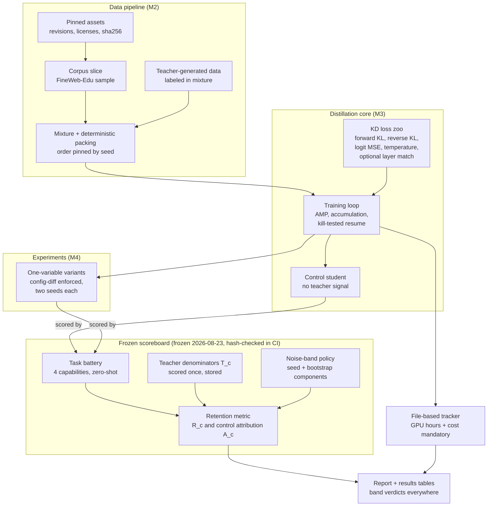
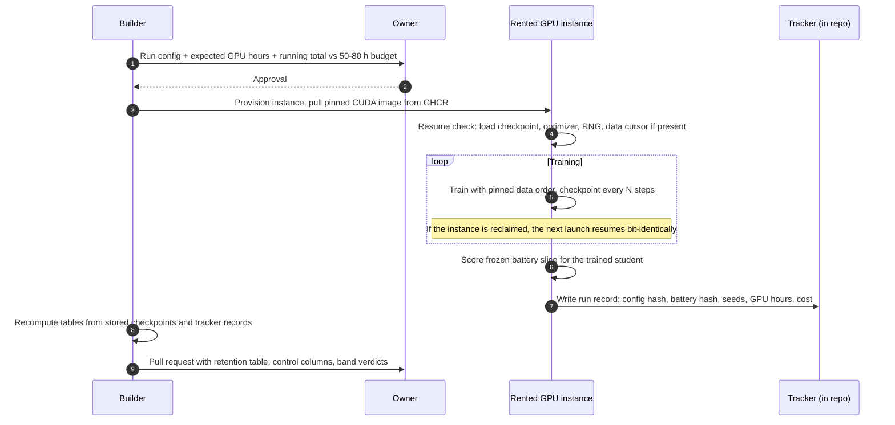

# Retention Lab

A distillation lab with a retention scoreboard. A pinned open-weights teacher is distilled into smaller students under a family of knowledge-distillation objectives, and every student is judged per capability against the teacher and against a control student of identical size and token budget trained with no teacher signal.

This repository is a study, not a product. There is no serving layer, no agent, and no user interface. Every addition must improve the rigor or the legibility of the retention comparison; anything else is out of scope.

- Issue-level plan: [`BREAKDOWN.md`](BREAKDOWN.md)
- Architecture decisions: [`docs/adr/`](docs/adr/)
- Canonical diagram: [`docs/architecture.html`](docs/architecture.html) (standalone HTML; the Mermaid diagrams below are its GitHub-renderable summaries)

## Table of contents

1. [The question](#1-the-question)
2. [Study design](#2-study-design)
3. [The retention scoreboard](#3-the-retention-scoreboard)
4. [Models, data, and licenses](#4-models-data-and-licenses)
5. [Architecture](#5-architecture)
6. [Run lifecycle](#6-run-lifecycle)
7. [Repository layout](#7-repository-layout)
8. [Quickstart on a CPU-only machine](#8-quickstart-on-a-cpu-only-machine)
9. [Deployment guide for a new developer](#9-deployment-guide-for-a-new-developer)
10. [GPU runs, budget, and cost tracking](#10-gpu-runs-budget-and-cost-tracking)
11. [Experiment series](#11-experiment-series)
12. [Results](#12-results)
13. [Engineering guarantees](#13-engineering-guarantees)
14. [Project governance](#14-project-governance)

## 1. The question

Knowledge distillation is usually reported as a single aggregate score, which hides the interesting structure: which capabilities survive distillation, which collapse, and how much of the surviving skill is attributable to the teacher signal rather than to ordinary training on the same tokens. Retention Lab answers three questions per capability:

1. **Retention**: how much of the teacher's capability, above chance, does the student keep?
2. **Attribution**: how much of that retention is caused by the teacher signal, measured against a control student of identical architecture, data, and token budget trained with plain language-model loss?
3. **Stability**: is the measured effect larger than seed-to-seed noise, under a noise-band policy frozen before any experiment runs?

## 2. Study design

The design enforces three disciplines that are commonly skipped:

1. **The scoreboard exists before the distillation core.** The task battery, the retention metric with control attribution, the teacher denominators, and the noise-band policy are built and frozen by content hash at the end of milestone M1. No knowledge-distillation code is written before that freeze. If a defect is found in the battery after the freeze, it is raised as an issue and documented; it is never patched silently.
2. **The control is the number to beat.** The control student is trained first. Every distillation result is reported as retention against the teacher and as a delta against the control. A student that does not beat the control is a documented negative result, not a discarded run.
3. **One variable per experiment.** Each experiment variant inherits the baseline configuration and overrides exactly one configuration block, enforced by an automated config-diff test. Data order is pinned by the shared seed, so paired runs see identical batches. Every variant runs at two seeds minimum, and any delta inside the noise band is reported as no effect, in the table and in the prose, without exception.

## 3. The retention scoreboard

### 3.1 Task battery and capability groups

All tasks are zero-shot and scored by deterministic log-likelihood comparison or exact continuation, so results contain no sampling noise. The battery is defined in `configs/battery/battery.yaml` and grouped into four capabilities:

| Capability | Tasks | Metric | Chance level |
|---|---|---|---|
| core-lm | Held-out corpus slice | bits per byte (BPB) | uniform-distribution BPB on the same slice |
| recall | SciQ, ARC-Easy | accuracy (length-normalized log-likelihood choice) | 0.25 |
| commonsense | HellaSwag, PIQA, Winogrande | accuracy (length-normalized log-likelihood choice) | 0.25, 0.50, 0.50 |
| comprehension | LAMBADA (OpenAI variant), BoolQ | accuracy (exact final word; log-likelihood choice) | 0.00, 0.50 |

Capability scores are the unweighted mean of chance-adjusted task scores inside the group. Task lists, evaluation slice identifiers, prompt formats, and metric definitions are frozen together with the scoring code at the end of M1; the freeze hash is checked in CI on every pull request.

**Freeze status: FROZEN on 2026-08-23** under hash `f7cfb197de8d1f75dd4ed606ad9f5be4700df40a7b5bbf5286a1470671167241` (recorded in [`configs/battery/FREEZE.yaml`](configs/battery/FREEZE.yaml), which also states the defect protocol). The hash covers `configs/battery/battery.yaml` and the five scoring source files, so a change to the measuring instrument is caught the same way as a change to the task list.

### 3.2 Retention with chance adjustment

For a capability `c` with student score `S_c`, teacher score `T_c`, and chance level `chance_c`:

```text
Accuracy-style metrics (higher is better):
    R_c = (S_c - chance_c) / (T_c - chance_c)

Bits-per-byte (lower is better; chance_c is the uniform-model BPB):
    R_c = (chance_c - S_c) / (chance_c - T_c)
```

`R_c = 1.0` means the student matches the teacher on that capability; `R_c = 0.0` means the student is at chance. Values above 1.0 (student beats teacher) and below 0.0 (student below chance) are reported as computed.

### 3.3 Control attribution

For the control student score `C_c` on the same capability:

```text
Accuracy-style:   A_c = (S_c - C_c) / (T_c - C_c)
Bits-per-byte:    A_c = (C_c - S_c) / (C_c - T_c)
```

`A_c` is the fraction of the teacher-control gap that the distilled student closes. Alongside `A_c`, every table reports the raw delta against the control, `S_c - C_c`, together with its noise-band verdict. Retention against the teacher is never reported without the control columns.

### 3.4 Noise-band policy

The policy is frozen at M1; the band values are produced later by applying the frozen procedure to real runs.

1. **Seed component.** For every variant trained at two seeds, compute the per-capability absolute difference between seeds. Pool these paired differences across all variants to estimate the seed standard deviation `sigma_c`. The seed component of the band is `1.96 * sqrt(2) * sigma_c`, the two-sided 95 percent interval for a difference of two independent seed draws.
2. **Eval-set component.** Bootstrap the evaluation set (10,000 resamples, fixed bootstrap seed recorded in the battery config) to obtain the 95 percent half-width of each capability score for the control student.
3. **The band.** `band_c = max(seed component, eval-set component)`. Any delta with `|delta| <= band_c` is reported as **no effect**. This verdict is binding for tables and for prose; no narrative may describe an inside-band delta as an improvement or a regression.

### 3.5 Teacher denominators

The teacher is scored exactly once on the full frozen battery, on the pinned GPU image, and the resulting `T_c` values are stored in `tracker/runs/` with the battery hash they were produced under. All later retention computations read the stored denominators; the teacher is never rescored unless the battery itself is formally unfrozen by a raised defect issue.

## 4. Models, data, and licenses

The Pythia suite is chosen because every model has research-grade pinned revisions and all sizes share one GPT-NeoX tokenizer, which makes logit-level distillation vocabulary-aligned by construction (ADR-0003).

| Asset | Role | License | Pinning |
|---|---|---|---|
| EleutherAI/pythia-1.4b | Teacher | Apache-2.0 | exact revision SHA recorded in `configs/assets.yaml` at M2 |
| Pythia-160m architecture | Student and control | Apache-2.0 | config-defined; from-scratch initialization by default |
| FineWeb-Edu sample slice | Training corpus | ODC-By 1.0 | shard list plus sha256 manifest in `configs/assets.yaml` at M2 |
| Teacher-generated continuations | Optional mixture component | derivative of teacher output | labeled `source: teacher_generated` in every mixture config |

Hygiene rules: download scripts and content hashes ship in the repository; weights and data never do. Exact revisions are resolved and recorded during M2 (issue-linked), never guessed. Every asset record carries its license string.

## 5. Architecture



The canonical, fully styled version of this diagram lives in [`docs/architecture.html`](docs/architecture.html), with a boundary box around the frozen scoreboard and a legend outside all boundaries. Any pull request that changes a component boundary or the run lifecycle updates both diagrams in the same pull request.

## 6. Run lifecycle

Every GPU run follows this sequence. No run launches without an approval message from the owner containing the configuration, the expected GPU hours, and the running total against the budget.



## 7. Repository layout

```text
retention-lab/
├── README.md                  Technical specification (this file)
├── BREAKDOWN.md               Issue-level plan: labels, milestones, all issues
├── LICENSE                    Apache-2.0 (code)
├── Makefile                   quickstart, test, lint, smoke, battery, train targets
├── pyproject.toml             Package metadata and pinned tooling
├── uv.lock                    Fully pinned dependency lockfile
├── .github/workflows/         ci.yml (lint, tests, smoke), cuda-image.yml (GHCR publish)
├── docker/Dockerfile.cuda     Pinned CUDA training image
├── configs/
│   ├── baseline.yaml          The single source every variant inherits from
│   ├── tiny.yaml              CPU-sized config used by quickstart and CI smoke
│   ├── battery/battery.yaml   Frozen task battery definition
│   ├── mixture/               Data mixture configs; teacher data labeled by source
│   └── variants/              One-block overrides, one file per experiment arm
├── src/retention_lab/
│   ├── battery/               Task registry, scoring, retention, bands, freeze hash
│   ├── data/                  Download scripts, packing, mixture, teacher generation
│   ├── kd/                    KD objective interface and loss zoo (M3)
│   ├── train/                 Training loop, checkpointing, resume (M3)
│   ├── models/                Teacher loading, student construction
│   ├── tracker/               Run records; GPU hours and cost are mandatory fields
│   └── utils/                 Seeding, config inheritance, hashing
├── scripts/                   Thin CLI entry points wrapping the package
├── tests/                     Unit tests, config-diff test, kill-and-resume test
├── docs/
│   ├── architecture.html      Canonical diagram (archify; dark theme)
│   ├── adr/                   Architecture decision records
│   └── results/               One page per experiment (M4), tradeoff table (M5)
└── tracker/runs/              Committed JSON records of real runs only
```

## 8. Quickstart on a CPU-only machine

`make quickstart` is the contract and the CI path. On a clean machine with Python 3.12 and [uv](https://docs.astral.sh/uv/):

```bash
git clone https://github.com/AmosBunde/retention-lab.git
cd retention-lab
make quickstart
```

Quickstart creates the virtual environment from the lockfile, installs the package, runs the linter, the prose lint, the unit tests (including the config-diff, data-determinism, and kill-and-resume suites), the frozen-scoreboard hash check, and the smoke run, entirely on CPU in about a minute. The smoke target reached its final ADR-0004 form at M3: a toy teacher trains on the bundled synthetic corpus, a smaller toy student distills from it with the configured KD objective, both loss traces must decrease, and the CI battery slice is scored with the toy model. The same target runs in CI on every pull request.

## 9. Deployment guide for a new developer

A step-by-step path from nothing to a reproduced result.

### 9.1 CPU development environment

1. Install prerequisites: Python 3.12, `uv`, `git`, and `make`. On Debian or Ubuntu: `sudo apt install make git`, then `curl -LsSf https://astral.sh/uv/install.sh | sh` and a Python 3.12 via `uv python install 3.12`.
2. Clone and bootstrap: `git clone https://github.com/AmosBunde/retention-lab.git && cd retention-lab && make quickstart`. A green quickstart means the environment is correct; there is no separate setup document to drift out of date.
3. Explore the tiny path: `make smoke` re-runs only the end-to-end tiny slice; `make test` runs the unit suite; `make lint` runs ruff with the pinned configuration.
4. Read the contract: this file, then `BREAKDOWN.md`, then the ADRs in order. The ADRs explain why the code is shaped the way it is.

### 9.2 Reproducing evaluation numbers

1. Download pinned assets: `make assets` fetches both Pythia models and the two corpus shards, verifies every file against the sha256 manifest in `configs/assets.yaml`, and refuses to proceed on any mismatch. Weights and data land under `assets/`, which is git-ignored; reruns are idempotent.
2. Verify the freeze: `make battery-hash` recomputes the scoreboard content hash (battery definition plus scoring code) and compares it with the frozen value in `configs/battery/FREEZE.yaml`; CI runs the same check.
3. Score a pinned model: `uv run python -m retention_lab.battery.score_model --model <repo> --revision <sha> --kind student --run-id <id> --slice full --device cpu --hourly-rate-usd <rate> --instance <name> --image-tag <tag> --out <file>` runs the full frozen battery and writes a schema-complete record; hours are measured and cost is derived, never typed in.
4. Rebuild every results table: `make results` renders retention tables exclusively from the committed records in `tracker/runs/`, and refuses to show a student without the teacher denominators and a control record.

### 9.3 GPU training environment

1. Pull the pinned image: `docker pull ghcr.io/amosbunde/retention-lab-cuda:<tag>`; the tag for every result is recorded in its tracker file.
2. Provision a single-GPU instance (the study targets one 24 GB to 40 GB card) with a persistent volume mounted at `/workspace`, and run `make assets` once inside the image to download and verify all pinned weights and corpus shards.
3. Launch one arm at one seed:

   ```bash
   docker run --gpus all -v /workspace:/workspace ghcr.io/amosbunde/retention-lab-cuda:<tag> -- \
     uv run python -m retention_lab.train.run_training \
       --config configs/variants/<variant>.yaml --seed <1 or 2> \
       --device cuda --bf16 --out-dir /workspace/runs/<variant>-seed<seed> \
       --hourly-rate-usd <rate> --instance "<provider and card>" --image-tag <tag>
   ```

   The loop checkpoints on the config cadence to the volume, and on completion scores the full frozen battery and writes the schema-complete tracker record (measured hours, derived cost, config hash, seed, tokens, reclaim count) into the output directory for the pull request.
4. Reclaims are safe by design: relaunching the same command resumes from the last checkpoint with bit-identical optimizer state, data order, and RNG streams, and increments the recorded reclaim count; the SIGKILL kill-and-resume test in CI guards this property.
5. A `--steps-override N` calibration segment verifies assets, memory headroom, and throughput on the instance before a full run commits; the override is stamped into the run output and calibration output never enters the tracker.

## 10. GPU runs, budget, and cost tracking

The total budget is 50 to 80 GPU hours on rented single-GPU instances. Every run writes a JSON record to `tracker/runs/` with this schema:

```json
{
  "run_id": "control-seed1",
  "config_hash": "sha256 of the resolved config",
  "battery_hash": "frozen battery hash the scores were produced under",
  "seed": 1,
  "tokens_trained": 500000000,
  "gpu_hours": 0.0,
  "cost_usd": 0.0,
  "instance": "provider and card",
  "image_tag": "ghcr tag",
  "scores": {"per capability": "raw task and capability scores"},
  "reclaims": 0
}
```

Only real runs produce tracker records. Nothing in this repository simulates, mocks, or fabricates a training environment, a run, a curve, or a result; the scoreboard, the report, and every pull request body contain tracker data from real executions only. GPU hours and cost appear in every results table.

### 10.1 Operator runbook for the pending runs

This subsection is the complete recipe for executing every pending run. It exists so that any operator with a single-GPU instance can finish the study without excavating issue threads; the approval requests on the issues remain the authoritative record of what the owner has cleared.

**Preconditions, restated where the operator will read them.** Every run below launches only after the owner has approved it on its tracking issue with an instance and an hourly rate; the running total against the 50 to 80 hour budget is restated at each approval. GPU hours are measured by the harness and cost is derived from the rate, so no number in a record is typed in. Only real executions produce records, and every record returns to the repository through a pull request on the run's issue.

**Getting an instance.** Any single 24 GB to 40 GB CUDA card works (RTX 4090 or A100 class). The two common paths:

1. Marketplace (vast.ai, RunPod, or similar): rent the card, choose an image-compatible template with Docker, and note the hourly rate; it goes into every command below and into the tracker.
2. Self-managed cloud VM (for example a Compute Engine or EC2 GPU instance): attach a persistent volume at `/workspace`, install Docker with the NVIDIA container toolkit, and proceed identically.

One-time setup on the instance:

```bash
docker pull ghcr.io/amosbunde/retention-lab-cuda:sha-5d42be749d60
docker run --gpus all -v /workspace:/workspace \
  ghcr.io/amosbunde/retention-lab-cuda:sha-5d42be749d60 -- \
  uv run python -m retention_lab.data.assets
```

`make assets` inside the image verifies every model file and corpus shard against the sha256 manifest and refuses to proceed on any mismatch.

**Stage 1: teacher denominators (issue #10, up to 3 GPU hours).** Completes the frozen scoreboard; the teacher is scored exactly once.

```bash
docker run --gpus all -v /workspace:/workspace \
  ghcr.io/amosbunde/retention-lab-cuda:sha-5d42be749d60 -- \
  uv run python -m retention_lab.battery.score_model \
    --model EleutherAI/pythia-1.4b \
    --revision fedc38a16eea3bd36a96b906d78d11d2ce18ed79 \
    --kind teacher --run-id teacher-battery-v1 --slice full \
    --device cuda --dtype float32 \
    --hourly-rate-usd RATE --instance "PROVIDER AND CARD" \
    --image-tag sha-5d42be749d60 \
    --out /workspace/teacher-battery-v1.json
```

The owner may alternatively approve running this one stage on a CPU workstation inside the same image at zero cost (roughly 17 CPU hours); that deviation from the GPU protocol is decided and recorded on issue #10, never taken silently.

**Stage 2: calibration, then the control pair (issue #22, up to 9 GPU hours for the pair).** Run a 100-step calibration segment first; it verifies memory headroom, bf16, throughput, and resume on the instance, and its output never enters the tracker:

```bash
docker run --gpus all -v /workspace:/workspace \
  ghcr.io/amosbunde/retention-lab-cuda:sha-5d42be749d60 -- \
  uv run python -m retention_lab.train.run_training \
    --config configs/variants/control.yaml --seed 1 \
    --device cuda --bf16 --steps-override 100 \
    --out-dir /workspace/runs/calibration \
    --hourly-rate-usd RATE --instance "PROVIDER AND CARD" \
    --image-tag sha-5d42be749d60
```

Kill the calibration once by hand mid-run and relaunch it to watch the resume; then run the full pair by repeating the command without `--steps-override`, with `--seed 1` and `--seed 2` and out-dirs `/workspace/runs/control-seed1` and `control-seed2`. A reclaimed instance is safe: relaunching the identical command resumes bit-identically and increments the recorded reclaim count.

**Stage 3: the experiment arms (issues #23 to #26), one approval at a time, in order.** Each arm is the same command with its variant file and both seeds: `e1-reverse-kl.yaml` plus the baseline arm `../baseline.yaml` for E1, then `e2-temperature-4.yaml`, `e3-mixture-30.yaml`, `e4-init-pretrained.yaml`. E3 first needs the teacher-generation run (issue #14): the pool-size choice (roughly 5 hours for a fresh 157M-token pool, or half the pool at half the cost with a documented repetition confound) is decided on the E3 approval, and generated shards pass to training with `--generated-dir`.

**Stage 4: INT8 and the tradeoff table (issues #28 and #29).** Quantize the best-attributed student with `retention_lab.deploy.int8`, rescore the full battery on CPU, and measure latency and memory under the fixed protocol in the same module.

**Returning results.** Copy each run's JSON record from its out-dir into `tracker/runs/`, open a pull request on the run's issue (experiment pull requests lead with the retention table and end with a non-empty "What I was wrong about"), and regenerate every table with `make results`. CI validates each record's schema, including the mandatory cost fields, before it can merge.

## 11. Experiment series

Twelve training runs are planned: the control and five distillation variants, at two seeds each. Each experiment issue pre-registers its hypothesis before any run launches.

| Series | Variable under test | Arms (each at seeds 1 and 2) |
|---|---|---|
| Control | none (no teacher signal) | control |
| E1 loss design | KD objective family | forward KL (baseline), reverse KL |
| E2 temperature | distillation temperature | baseline T=2.0 versus T=4.0 |
| E3 data mixture | teacher-generated share | 0 percent (baseline) versus 30 percent |
| E4 initialization | student starting point | from scratch (baseline) versus pretrained pythia-160m |

The baseline arm (forward KL, T=2.0, 0 percent teacher-generated data, from-scratch initialization) is trained once in E1 and reused as the shared reference for E2 through E4; every other arm differs from it in exactly one configuration block, and the config-diff test enforces this at CI time.

## 12. Results

Results tables are generated from `tracker/runs/` records of real GPU runs and inserted here as experiments merge. As of the current commit, no GPU run has executed, so this section intentionally contains the planned run matrix instead of numbers; the definition of done for the project replaces this matrix with the full per-capability table (retention against teacher, delta against control, band verdict, GPU hours, cost) for every arm listed in section 11. Every pending run is executable from the operator runbook in section 10.1 by anyone with an approved instance.

| Run | Status |
|---|---|
| teacher battery scoring (denominators) | approval requested on issue #10; command and estimate posted |
| control, seeds 1 and 2 | approval requested on issue #22; command, calibration plan, and estimate posted |
| teacher generation (E3 data pool) | pipeline merged; pool-size decision and approval pending with the E3 request |
| E1 forward KL baseline and reverse KL, seeds 1 and 2 | configs merged and config-diff enforced; runs follow the control results |
| E2 temperature, seeds 1 and 2 | configs merged; runs follow the control results |
| E3 mixture, seeds 1 and 2 | configs merged; runs follow the generation pool |
| E4 initialization, seeds 1 and 2 | configs merged; runs follow the control results |
| INT8 pass on the best student | quantization and measurement protocol merged; awaits the best student |

## 13. Engineering guarantees

These properties are tested, not assumed:

- **Determinism**: seeded RNG streams for model init, data shuffling, and dropout; deterministic algorithms enabled; data order is a pure function of the shared seed.
- **Resumability**: the kill-and-resume test trains, checkpoints, kills, resumes, and asserts bit-identical continuation of loss values, optimizer state, data cursor, and RNG streams against an uninterrupted reference run.
- **One-variable discipline**: the config-diff test resolves any variant against the baseline and fails if more or fewer than one top-level block differs.
- **Freeze integrity**: the battery-hash check recomputes the scoreboard content hash on every pull request and fails on any drift from the frozen value.
- **Budget honesty**: the tracker schema rejects run records missing GPU hours or cost.

## 14. Project governance

- Milestones run strictly in order: M0 scaffold, M1 scoreboard, M2 data and assets, M3 distillation core, M4 experiments, M5 handoff and report. A milestone does not start before the previous one is merged to main with CI green.
- One issue equals one branch equals one pull request; branches are created with `gh issue develop` so the link is native. There are no direct commits to main; the empty root commit that gave the first pull request a base branch is the single documented exception.
- Commits are conventional with why-first bodies and a `Refs #<n>` footer; pull requests close their issue with `Closes #<n>`; experiment pull requests lead with the retention table and end with a non-empty "What I was wrong about" section.
- All prose in this repository avoids contractions and em dashes, and no file contains an unfilled placeholder.

Code license: Apache-2.0. Model and data licenses are recorded per asset in section 4 and in `configs/assets.yaml`.
